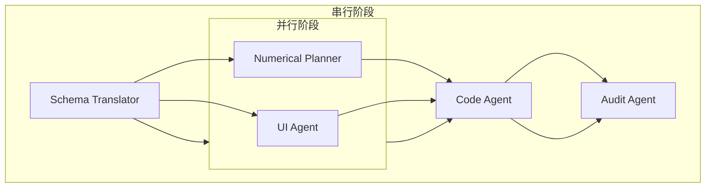

好的，资深游戏开发项目经理。根据您提供的终审通过的《背包系统 - 宏观设计草案》，我已进行WBS拆解，并制定了详细的执行计划。

---

## 背包系统 - WBS 任务拆解与执行计划

### 1. 任务分解

#### 1.1 Schema Translator (格式翻译)
- **任务名称**：将背包系统MD草案翻译为结构化JSON Schema
- **输入文件**：`背包系统 - 宏观设计草案.md`
- **产出文件**：`bag_system_schema.json`
- **具体任务**：
    1.  将“系统概述与设计愿景”中的规则性描述（前置条件、流转逻辑、数据状态变化、边界异常）翻译为JSON Schema中的`system_meta`和`entry_conditions`。
    2.  将“核心规则与玩法机制”中的每个功能点（分类筛选、道具操作、容量规则）翻译为独立的JSON Schema对象，包含`preconditions`、`flow_logic`、`data_changes`、`boundary_handling`。
    3.  将“表现层与角色展示联动”中的UI风格、运镜、物理反馈等规则性描述翻译为`presentation_rules`。
    4.  将“经济循环与商业化埋点”中的免费产出、付费埋点、资源循环规则翻译为`economy_rules`。
    5.  将“旧系统与数据联动”中的接口调用规则翻译为`system_dependencies`。
    6.  将“待确认风险与追问”中的风险点翻译为`risks_and_open_questions`。

#### 1.2 Numerical Planner (数值策划)
- **任务名称**：背包系统数值表设计与填值
- **输入文件**：`bag_system_schema.json`
- **产出文件**：`bag_system_numerical.xlsx`
- **具体任务**：
    1.  根据Schema中的`[INITIAL_BAG_CAPACITY]`、`[MAX_STACK_SIZE]`、`[EXPAND_SLOTS_PER_USE]`等占位符，设计并填入具体数值。
    2.  设计背包扩容券的投放节奏与价格曲线（免费获取 vs 付费购买）。
    3.  设计道具稀有度（N/R/SR/SSR）的分布比例与基础数值（如出售价格）。
    4.  与系统策划确认首批100种道具的ID分配与基础属性（如堆叠上限、是否可出售）。

#### 1.3 UI Agent (UX/UI 设计)
- **任务名称**：背包系统UI界面与交互设计
- **输入文件**：`背包系统 - 宏观设计草案.md`
- **产出文件**：`bag_system_ui_design.md` (含低保真线框图与交互说明)
- **具体任务**：
    1.  设计背包主界面布局：顶部标签栏（材料/礼物/消耗品/任务道具/其他），中部道具网格列表（4列），底部容量显示与扩容入口。
    2.  设计道具详情浮窗：展示道具图标、名称、描述、稀有度、持有数量、来源说明、操作按钮（使用/丢弃）。
    3.  设计“使用”与“丢弃”的二次确认弹窗。
    4.  设计“背包已满”的系统提示与跳转逻辑。
    5.  设计“暂无道具”的占位图与“前往获取”跳转链接。
    6.  确保所有UI组件采用半透明毛玻璃风格，不遮挡主界面角色展示。

#### 1.4 Code Agent (程序执行)
- **任务名称**：背包系统核心逻辑与接口开发
- **输入文件**：`bag_system_schema.json`, `bag_system_numerical.xlsx`
- **产出文件**：`bag_system.gd` (核心逻辑脚本), `bag_item_data.gd` (道具数据模型)
- **具体任务**：
    1.  实现道具数据模型 `BagItemData`，包含 `item_id`, `item_name`, `item_type`, `rarity`, `stack_size`, `max_stack_size` 等字段。
    2.  实现背包核心逻辑 `BagSystem`，包含：
        -   `add_item(item_id, count)`：添加道具，处理堆叠与背包满溢（调用邮件系统接口）。
        -   `remove_item(item_id, count)`：移除道具，处理数量不足的异常。
        -   `use_item(item_id, count)`：使用消耗品，调用对应效果逻辑。
        -   `discard_item(item_id, count)`：丢弃道具，二次确认后移除。
        -   `sort_items(category_id, sort_order)`：按分类与稀有度排序。
        -   `expand_capacity(slots)`：扩容逻辑。
    3.  实现背包UI与核心逻辑的绑定，确保所有操作响应流畅。
    4.  实现与邮件系统、商城系统的接口对接。

#### 1.5 Audit Agent (审查官)
- **任务名称**：背包系统数值与逻辑审查
- **输入文件**：`bag_system_schema.json`, `bag_system_numerical.xlsx`, `bag_system_ui_design.md`
- **产出文件**：`bag_system_audit_report.md`
- **具体任务**：
    1.  审查数值表：确认初始容量、扩容成本、堆叠上限等数值是否合理，是否符合商业化预期。
    2.  审查逻辑闭环：确认道具的产出、消耗、堆叠、丢弃、满溢处理等逻辑是否形成完整闭环，无遗漏或矛盾。
    3.  审查UI设计：确认UI交互是否符合“高效、低干扰”的设计目标，无深层嵌套。
    4.  审查边界情况：确认所有异常情况（背包满、道具不足、不可使用等）都有明确的处理逻辑与用户提示。

### 2. 执行顺序与依赖

- **串行任务**：
    1.  **Schema Translator** 必须先完成，为后续所有任务提供结构化输入。
    2.  **Code Agent** 必须在 **Numerical Planner** 和 **UI Agent** 完成后才能开始，因为需要具体的数值和UI设计来编写逻辑。
    3.  **Audit Agent** 必须在所有开发任务完成后进行最终审查。

- **并行任务**：
    - **Numerical Planner** 和 **UI Agent** 可以完全并行执行，因为它们分别处理数值和UI设计，互不依赖。

### 3. 风险提示

- **阻塞点**：
    1.  **数值确认延迟**：`[INITIAL_BAG_CAPACITY]`、`[MAX_STACK_SIZE]` 等关键数值若未及时确认，将阻塞 **Numerical Planner** 和 **Code Agent** 的进度。
    2.  **接口定义冲突**：背包系统与邮件系统、商城系统的接口定义（如 `add_item` 的参数格式）若未提前对齐，可能导致 **Code Agent** 开发完成后需要返工。
    3.  **UI资源缺失**：首批100种道具的2D图标若未按时交付，将导致 **UI Agent** 无法完成最终设计，或 **Code Agent** 无法进行UI绑定。

- **跨团队依赖冲突**：
    1.  **与邮件系统团队**：需明确背包满溢时，道具进入邮件的具体数据结构与过期时间（30天）。
    2.  **与商城系统团队**：需明确购买礼包后，调用 `add_item` 接口的时机与错误处理。
    3.  **与战斗/活动系统团队**：需明确产出道具时，调用 `add_item` 接口的时机与背包满时的处理逻辑（是直接进入邮件还是提示玩家）。

- **性能风险**：
    - 当玩家持有道具种类接近300种上限时，列表加载与排序可能出现卡顿。**Code Agent** 需提前考虑使用虚拟列表或分页加载技术进行优化。
